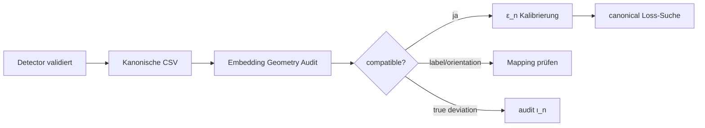

# Shell Embedding Geometry Audit Protocol

**Evidence layer:** E-077 / E-078 model validation only  
**Status:** `[C]` — diagnostic measurement layer only  
**Date:** 2026-07-05

---

## Governance Box

| Rule | Status |
|---|---|
| Modellvalidierung only | ✅ |
| **Kein** `MetricSeparationLossExist`-Claim | ✅ |
| **Kein** `first_loss_n` in diesem Audit-Output | ✅ |
| `shellPrimeMatchAtFirstLoss` | **INACTIVE** |
| Meissner-Sprache | `[C]` interpretive vocabulary only |
| Lean / `[B]` upgrade | ❌ not implied by this audit |

> Bulk stable, shell carries stress — interpretive only; not evidence for separation loss or prime coupling.

---

## Purpose

Rigoroser Geometrie-Audit: Messen **canonical_from_qcc_bridge** und **theorematic Energiedoku** dieselbe endliche Geometrie (bis auf Translation, Rotation, Skalierung, Label-Permutation)?

**Reihenfolge (STRICT):**

1. canonical vs Energiedoku vergleichen  
2. Abweichung klassifizieren  
3. **ι_n nur bei echter Strukturabweichung** revidieren — nicht vorher

Dieser Audit **ersetzt nicht** die Punkt-für-Punkt-Vergleiche in `shell_embedding_comparison_n123.csv`; er ergänzt sie um **invariantenbasierte** Shape-Vergleiche.

---

## Embedding Audit Rule

The canonical embedding ι_n must not be revised before it is compared against the explicit Energiedoku coordinates for n=1,2,3.

The comparison is performed on geometric invariants, not on raw coordinates alone:
sep(n), overlap(n), distance spectrum, Gram spectrum, radius profile, Procrustes RMSD.

Absolute coordinates may differ by translation, rotation, scaling, or permitted relabeling. Only invariant disagreement counts as structural disagreement.

If the canonical and Energiedoku embeddings agree on invariants, ι_n remains accepted for diagnostic use. If they disagree, the discrepancy must be classified before any ε_n-calibration, ShellSeparationLoss(n) search, or shellPrimeMatchAtFirstLoss test is interpreted.

This comparison is a model-validation step only. It does not prove MetricSeparationLossExist, does not establish a global R^3-embedding, does not determine n_0, and does not activate shellPrimeMatchAtFirstLoss.

### Merksätze (DE)

> **Merksatz (DE):** Nicht ι_n reparieren, bevor bewiesen ist, dass ι_n das Problem ist.

> **Merksatz (DE):** Explizite Energiedoku-Koordinaten für n=1,2,3 maschinenlesbar machen — ohne CSV bleibt jeder Vergleich Toy/Fallback.

> **Merksatz (DE):** Invarianten stimmen ⇒ canonical ist kompatibel.

> **Merksatz (DE):** Invarianten weichen ab ⇒ ι_n-Audit, aber noch kein Loss-Claim.

### Kanonischer Pfad (Pipeline)

1. **Detector-Controls bestanden** — `shell_detector_controls.csv`  
2. **Energiedoku-Koordinaten n=1,2,3 kanonisieren** — `shell_coordinates_energiedoku_n1_n3.csv`  
3. **Embedding-Audit ausführen** — dieses Protokoll  
4. **Nur bei echter Invariantenabweichung ι_n überdenken**  
5. **Erst danach ε_n-Regel schärfen** — separater Diagnose-Lauf (kein Gate für E-085)

---

## Invarianten

| Invariante | Definition |
|---|---|
| `sep(n)` | Minimale paarweise Centroid-Separation |
| `overlap(n)` | Überlappungszähler bei theorematischem `ε_n` (in `notes`, nicht CSV-Spalte) |
| Distanzspektrum | L2 zwischen sortierten paarweisen Distanzen (shape-normalisiert) |
| Gram-Spektrum | L2 zwischen sortierten Eigenwerten der Gram-Matrix (shape-normalisiert) |
| Radiusprofil | L2 zwischen sortierten Abständen vom Schwerpunkt (shape-normalisiert) |
| Procrustes-RMSD | RMSD nach optimaler Ähnlichkeitstransformation + optionaler Label-Permutation (≤ 8 Punkte) |

Shape-Normalisierung: Zentrierung am Schwerpunkt, Skalierung auf Einheits-Frobenius-Norm.

---

## Vergleichsmodi

| Modus | Canonical | Energiedoku | Fair? |
|---|---|---|---|
| `matched_n_plus_1` (Default) | `n+1` Prefix | erste `n+1` lex-Wörter | ✅ gleiche Punktzahl |
| `full` | `n+1` Prefix | alle `4^n` Wörter | ❌ Kombinatorik-Mismatch; `count_mismatch` |

**Harte Regel:** Invariantenvergleich (Distanz-/Gram-Spektrum, Procrustes) erfordert **gleiche Punktzahl**. Für fairen Geometrievergleich → `matched_n_plus_1`.

---

## Entscheidungslogik

| Ergebnis | Deutung | Aktion |
|---|---|---|
| `sep`, Distanzspektrum, Gram stimmen überein; Procrustes klein | **compatible** | weiter `ε_n`-Kalibrierung |
| `sep` ok, Procrustes groß | **label/orientation** | Prefix↔Word-Mapping prüfen (`shell_prefix_word_map`) |
| Distanzspektrum weicht ab | **true geometric deviation** | **audit ι_n** |
| nur `n=3` weicht ab | **possible first break** | `n=3` isolieren |
| Punktzahl ungleich | **count_mismatch** | `matched_n_plus_1` verwenden |

**Harte Regel:** Unified-ι_n-Brücke **nur** revidieren, wenn der Invarianten-Audit echte geometrische Abweichung zeigt — nicht bei reiner Label-/Orientierungsfrage.

---

## Pipeline



Siehe **Kanonischer Pfad** oben (Schritte 1–5). Kurzfassung:

1. **Detector validiert** — `shell_detector_controls.csv`  
2. **Energiedoku-Koordinaten kanonisieren** — `shell_coordinates_energiedoku_n1_n3.csv`  
3. **Embedding Audit** — dieses Protokoll  
4. **ι_n nur bei echter Invariantenabweichung** überdenken  
5. **ε_n-Regel schärfen** — theorematische Schwellen (Energiedoku §8); separater Diagnose-Lauf (kein Gate für E-085)

---

## Module & Reproduce

**Module:** `src/kepler_hurwitz/shell_embedding_geometry_audit.py`

```bash
# Default: fair matched_n_plus_1 comparison
PYTHONPATH=src python scripts/shell_embedding_geometry_audit.py --n-max 3

# Full 4^n energiedoku (count mismatch expected)
PYTHONPATH=src python scripts/shell_embedding_geometry_audit.py --n-max 3 --mode full
```

**Export:** `docs/energiedoku_exports/shell_embedding_comparison_n1_n3.csv`

### CSV columns

`n`, `source_a`, `source_b`, `point_count_a`, `point_count_b`, `sep_a`, `sep_b`, `sep_abs_diff`, `sep_rel_diff`, `distance_spectrum_l2`, `gram_spectrum_l2`, `radius_profile_l2`, `procrustes_rmsd`, `compatible`, `notes`

---

## Related exports

| File | Role |
|---|---|
| `shell_coordinates_energiedoku_n1_n3.csv` | **Kanonische Source of Truth** — Energiedoku-Koordinaten n=1,2,3 (`n,shell,label,x,y,z`; volle `4^n` = 84 Zeilen) |
| `shell_embedding_comparison_n123.csv` | Punkt-für-Punkt Koordinatenvergleich |
| `shell_prefix_word_map_n123.csv` | Prefix ↔ EABC-Wort-Mapping |
| `shell_energiedoku_full_n23.csv` | Volle `4^n` sep/overlap (separater Lauf) |

### Canonical coordinates CSV

**Columns:** `n`, `shell`, `label`, `x`, `y`, `z`

- `n` — Renorm-Stufe (1, 2, 3)  
- `shell` — Shell-Index (0 … `4^n − 1`, lex EABC-Wort-Reihenfolge)  
- `label` — EABC-Wort (z. B. `E`, `EA`, `EEE`)  
- `x`, `y`, `z` — Lean `cardinalShellEmbedding_*` / lattice `(φ^{-n})·classIndex`

**Point counts (full mode):** n=1 → 4, n=2 → 16, n=3 → 64 (total 84 rows).

**Loader:** `src/kepler_hurwitz/energiedoku_shell_construction.py` reads this CSV when present; falls back to code generation from Lean rules if missing.

---

## E-085 gate status (this audit)

| Gate | Status |
|---|---|
| Geometry audit implemented | ✅ |
| `MetricSeparationLossExist` proved | ❌ **not claimed** |
| `first_loss_n` in audit output | ❌ **excluded** |
| `shellPrimeMatchAtFirstLoss` | ❌ **INACTIVE** |
| Replace qec_bridge with energiedoku | ❌ not supported |

---


## Pipeline status (2026-07-05)

**Audit scharf geschaltet:** [`shell_coordinates_energiedoku_n1_n3.csv`](../energiedoku_exports/shell_coordinates_energiedoku_n1_n3.csv) ist vorhanden (84 Datenzeilen); der Audit nutzt die CSV-Quelle, nicht den Code-Fallback.

| Schritt / Gate | Status |
|---|---|
| Detector-Controls | **DONE** |
| Energiedoku-Koordinaten n = 1, 2, 3 (84 Zeilen) | **DONE** |
| Embedding Geometry Audit (n = 1 compatible; n = 2/3 deviation) | **DONE** |
| ι_n-Revision (n ≥ 2) | **NEXT** |
| ε_n-Schärfung | **PENDING** |
| ShellSeparationLoss(n)-Suche | **later** |
| `shellPrimeMatchAtFirstLoss` | **INACTIVE** |

**Nächster konkreter Schritt:** theorematisches ι_n für n ≥ 2 auditieren — **nicht** CSV-Generierung, **nicht** ShellSeparationLoss-Suche.

---

## Audit results (matched_n_plus_1, 2026-07-05)

| n | compatible | classification | sep_a | sep_b | dist_l2 | procrustes |
|---|---|---|---|---|---|---|
| 1 | yes | compatible | √2 ≈ 1.414 | √2 | 0 | ~0 |
| 2 | no | true_geometric_deviation | √2 | φ⁻² ≈ 0.382 | 0.586 | 0.625 |
| 3 | no | possible_first_break_n3 | √2 | φ⁻³ ≈ 0.236 | 0.631 | 0.679 |

**Interpretation:**

- **n=1:** Gleiche endliche Geometrie (rechtwinkliges 2-Punkt-Muster in der Ebene) bis auf Ähnlichkeitstransform — **keine ι_n-Revision**.
- **n=2:** `sep` und Distanzspektrum weichen ab — **echte geometrische Abweichung**, nicht nur Label/Orientierung (Procrustes bleibt groß).
- **n=3:** Wie n=2, zusätzlich als **possible first break** markiert — n=3 isoliert prüfen.

**Empfehlung:** ι_n-Revision **indicated** für n≥2 (theorematisches Mapping auditieren). Unified-B2-Brücke **nicht** vor Abschluss dieses Audits ersetzen.

---

## See also

- **[Embedding Audit Pipeline](EMBEDDING_AUDIT_PIPELINE.md)** — kanonische interne Referenz (Goldene Regel, Pipeline Schritte 1–5, Status)
- [Shell Separation Diagnostics Protocol](shell_separation_diagnostics_protocol.md) — parent protocol, detector + sep pipeline
- `docs/energiedoku_exports/shell_embedding_comparison_n123.csv` — coordinate-level comparison
