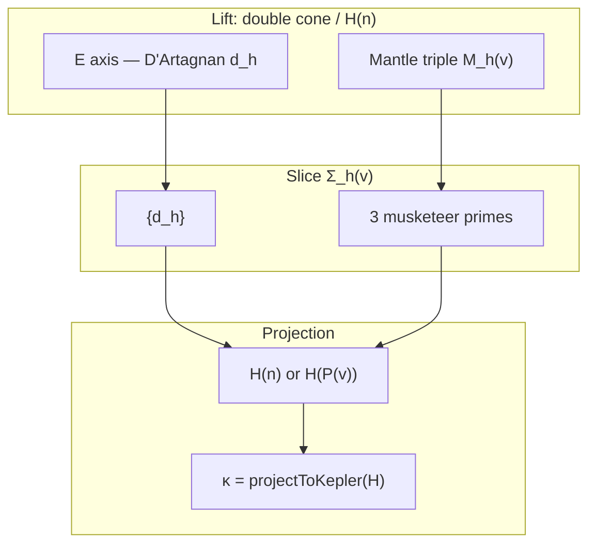

# Dumas Cone–Orbit Model

**Stand:** 5. Juli 2026  
**Governance:** `[C]` methodische Analogie — **gleiche Methode, nicht gleiche Objekte**  
**Lean (arithmetisch geschlossen):** `KeplerHurwitz/PrimvierlingSymmetry.lean` (E-048)  
**Lift-Parallel:** [`kepler_quaternion_lift_projection.md`](kepler_quaternion_lift_projection.md), [`grundgedanken.md`](../grundgedanken.md)

---

## 1. Motivation

The Dumas lemma (`dumasLemma`) certifies a four-host complementarity on every distinct primvierling \(v=(a,b,c,e)\): each host channel sees exactly three “musketeer” primes and one isolated “D'Artagnan” prime. This note places that **fixed combinatorial condition** inside the repo’s **double-cone lift–projection** vocabulary and adds a **dynamic weight orbit** on the channel simplex.

**Not claimed:** that the circle/ellipse pictures are physical Kepler orbits, or that the weight dynamics produce new primes.

---

## 2. State space and notation

| Symbol | Meaning | Repo |
|---|---|---|
| \(v=(a,b,c,e)\) | Primvierling 4-tuple | `Primvierling` in Lean / Python |
| \(P(v)=\{a,b,c,e\}\) | Underlying prime set | `primvierlingFinset v` |
| \(h\in\{E,A,B,C\}\) | Host channel | `EABCChannel` |
| \(d_h(v)=\texttt{hostComponent}(h,v)\) | D'Artagnan prime for host \(h\) | Lean `hostComponent` |
| \(M_h(v)=\texttt{hostTriple}(h,v)\) | Musketeer triple | \(P(v)\setminus\{d_h(v)\}\), `|M_h|=3` |
| \(H(n)=(E,A,B,C)\) | EABC signature | `EABCSignature4`, `signatures.py` |
| \(M(n)=E+A+B+C\) | Total channel mass | `totalWeight` |
| \(\Delta^3\) | Channel simplex \(\{p\in\mathbb{R}^4_{\ge0}:\sum p_c=1\}\) | `channel_entropy` weights |

**Dumas bundle** (E-048, proved):

\[
\texttt{hostTriple}(h,v)\cup\{d_h(v)\}=P(v),\quad
|M_h(v)|=3,\quad
\forall x\in P(v):\ |\{h: x\in M_h(v)\}|=3.
\]

**Host–component map** (Lean convention):

\[
E\mapsto e,\quad A\mapsto a,\quad B\mapsto b,\quad C\mapsto c.
\]

**Example** \(v=(11,13,17,19)\):

| Host | D'Artagnan \(d_h\) | Musketeers \(M_h\) |
|---|---|---|
| E | 19 | {11, 13, 17} |
| A | 11 | {13, 17, 19} |
| B | 13 | {11, 17, 19} |
| C | 17 | {11, 13, 19} |

---

## 3. Natural-fill slots 1–12

The Python layer `dumas_natural_fill` (see `tests/test_dumas_natural_fill.py`) linearises the four musketeer triples into **12 triple slots**:

\[
\mathcal{F}(v)=\bigcup_{h\in\{E,A,B,C\}} \{(h,1,x_1),(h,2,x_2),(h,3,x_3)\},
\quad \{x_1,x_2,x_3\}=M_h(v),
\]

indexed \(k=1,\ldots,12\) in host order \(E,A,B,C\). Each slot carries a prime from \(M_h(v)\); the host prime \(d_h(v)\) is **absent** (holographic omission: `dumas_gap_encodes_host`).

Classic assignment for \(v=(11,13,17,19)\):

| Slot | Host | Prime |
|---|---|---|
| 1–3 | E | 11, 13, 17 |
| 4–6 | A | 13, 17, 19 |
| 7–9 | B | 11, 17, 19 |
| 10–12 | C | 11, 13, 19 |

**Rotor pattern** (`dumas_drillinge.csv`): successive canonical quadruplets cycle hosts \(E\to A\to B\to C\) with fixed gap-pairs \((2,4),(4,2),(6,2),(2,6)\) on sorted musketeer gaps — a discrete orbit on **host perspective**, not on \(P(v)\) itself.

---

## 4. Double-cone lift (methodical layer)

From [`grundgedanken.md`](../grundgedanken.md), the **arithmetic double cone** carries

\[
\mathcal{H}(n)=(O,E,A^+,B^+,C^+,A^-,B^-,C^-),
\]

with \(E\) the **axis** and \((A^\pm,B^\pm,C^\pm)\) oriented mantle lines. Aggregation gives \(H(n)\); chirality \((\alpha,\beta,\gamma)\) lives on the mantle.

**Givental parallel** ([`kepler_quaternion_lift_projection.md`](kepler_quaternion_lift_projection.md)):

\[
\text{Lift} \;\Rightarrow\; \text{Slice} \;\Rightarrow\; \text{Project},\qquad
\mathcal{O}=\pi_K(C\cap\Pi),\quad
H=\pi_Q(\mathcal{Q}_{\mathrm{arith}}\cap\mathcal{S}).
\]

### 4.1 Dumas cut in the cone

Fix host \(h\) and primvierling \(v\). Define the **Dumas slice**:

\[
\Sigma_h(v) \;=\; \underbrace{\{d_h(v)\}}_{\text{D'Artagnan / axis point}}
\;\cup\;
\underbrace{M_h(v)}_{\text{three mantle primes}}.
\]

| Role | Set-theoretic | Cone analogy `[C]` |
|---|---|---|
| D'Artagnan | singleton \(\{d_h\}\) | point on **axis circle** (isolated coordinate) |
| Musketeers | 3-set \(M_h\) | triple on **complementary mantle** — “reverse” = set complement in \(P(v)\) |
| Full cut | \(\Sigma_h=P(v)\) | plane section restoring all four channels |

**Reverse/complement:** musketeers are not a permutation of \((a,b,c,e)\); they are the **formal complement** \(P(v)\setminus\{d_h\}\). On the 8D cone, the complementary triple can be read as the three non-\(h\) coordinates with orientation \((A^\pm,B^\pm,C^\pm)\) — analogy only.

---

## 5. Weight partition (sum to 1)

### 5.1 Channel simplex (fixed \(n\))

For any \(H(n)\) with \(M(n)>0\):

\[
\mathbf{p}(n)=\Bigl(\frac{E}{M},\frac{A}{M},\frac{B}{M},\frac{C}{M}\Bigr)\in\Delta^3.
\]

This is the standard weight vector in `channel_entropy` (`diagnostics.py`): probabilities over EABC channels, **not** over individual primes.

### 5.2 Component simplex (fixed primvierling, host perspective)

On \(P(v)\), define host-\(h\) weights \(\mathbf{w}^{(h)}\in\Delta^3\) on the four primes by

\[
w^{(h)}_x = \begin{cases}
\omega_h & x=d_h(v),\\[4pt]
\dfrac{1-\omega_h}{3} & x\in M_h(v),
\end{cases}
\qquad \omega_h\in[0,1].
\]

Then \(\sum_{x\in P(v)} w^{(h)}_x = 1\). Default **balanced host**: \(\omega_h=\tfrac14\) (uniform on four primes).

### 5.3 Dynamic orbit

Let \(\rho:\mathbb{Z}\to\{E,A,B,C\}\) be the **host rotor** (e.g. `host_for_quadruplet_index` in `dumas_natural_fill`, cycle \(E,A,B,C,E,\ldots\)).

A **Dumas orbit state** at time \(t\) is

\[
\mathcal{O}_t = \bigl(h_t,\; \mathbf{w}^{(h_t)},\; d_{h_t}(v),\; M_{h_t}(v)\bigr),
\qquad h_t=\rho(t).
\]

**Conservation:** for fixed \(v\), the multiset \(P(v)\) is invariant; only the **D'Artagnan label** rotates among hosts via `hostComponentEquiv`. This is the dynamic reading of *Un pour tous, tous pour un*.

Optional coupling to EABC: map each prime \(x\in P(v)\) to channel \(\chi(x)=x\bmod 12\) class (`eabc_channel_from_mod12`) and push forward \(\mathbf{w}^{(h)}\) to a channel vector on \(\Delta^3\) — generally **not** equal to \(\mathbf{p}(P(v))=(\tfrac14,\tfrac14,\tfrac14,\tfrac14)\) because mod-12 classes need not be bijective on \(P(v)\).

---

## 6. Kepler projection (four-host case)

Given \(H=(E,A,B,C)\), Lean `projectToKepler` (`EABCLayer.lean`) defines

\[
a=\frac{M}{4},\qquad
e=\frac{\max-\min}{M+1},\qquad
R_v=\frac{1+e}{1-e}.
\]

For a **full primvierling product** \(H(P(v))=(1,1,1,1)\): \(M=4\), \(e=0\), circular degenerate ellipse — the **symmetric centre** of the channel simplex.

**Cone–Kepler analogy `[C]`:** each host slice \(\Sigma_h(v)\) picks one axis point and a triangular mantle section; projecting \(H(P(v))\) yields one Kepler triple \((a,e,R_v)\). The **rotor** changes which prime is axis-isolated, not the aggregate signature of the product.

---

## 7. Two-prime degenerate extension

When only **two primes** \(\{p,q\}\) are available (e.g. twin pair), a full Dumas 4-set does not exist. Model a **product configuration**:

\[
\mathcal{C}_{p,q} = \bigl(\kappa_p,\;\kappa_q,\;\Phi_{p,q}\bigr),
\qquad
\kappa_p = \texttt{projectToKepler}(H(p)),\;
\kappa_q = \texttt{projectToKepler}(H(q)).
\]

**Two Kepler ellipses:** independent projections from two EABC signatures — two points in \((a,e)\)-space.

**Missing musketeers via inverses:** extend \(P\) formally to four labels by **phantom complements**

\[
\widetilde{P} = \{p,q\}\cup\{p^{-1},q^{-1}\},
\]

where \(p^{-1},q^{-1}\) are **free formal slots** (not primes) carrying the Dumas gap roles for hosts that would require two further components. Host triples become partial:

\[
M_h^{\mathrm{part}}\subseteq \widetilde{P}\setminus\{d_h\},\qquad |M_h^{\mathrm{part}}|\le 3,
\]

with weights on \(\widetilde{P}\) still summing to 1 after assigning \(\omega_h\) to observed primes and splitting the remainder among inverses.

**Simplex drop:** channel weights live on \(\Delta^1\) (two observed channels) instead of \(\Delta^3\); the dynamic orbit is a **product of two 1-dimensional ellipses** plus a **[C] glue interface** between phantom slots — not covered by E-048.

---

## 8. Diagrams

### 8.1 Dumas host slice (one host)



### 8.2 ASCII: four-host rotor on one primvierling

```
        P(v) = {a, b, c, e}
                 │
    ┌────────────┼────────────┐
    │            │            │
 host E        host A       ... 
 d=e           d=a
 M={a,b,c}     M={b,c,e}
    │            │
    └─ slots 1-3 └─ slots 4-6  ...  (12 total)

Rotor: E → A → B → C → E → ...
Weights w^(h) on P(v),  Σ w = 1  at each step
```

---

## 9. Repo map

| Model piece | Location |
|---|---|
| `hostComponent`, `hostTriple`, `dumasLemma` | `KeplerHurwitz/PrimvierlingSymmetry.lean` |
| Gap encodes host | `dumas_gap_encodes_host` (E-048) |
| Natural fill 1–12, rotor | `kepler_hurwitz/dumas_natural_fill.py`, `dumas_drillinge.csv` |
| CEAB orbit invariants | `shiftCEAB`, `quatNorm`, `pairGapsInt` |
| Double cone 8D | `docs/grundgedanken.md`, `HurwitzSignature8D` |
| Lift–projection | `docs/theory/kepler_quaternion_lift_projection.md` |
| `projectToKepler` | `KeplerHurwitz/EABCLayer.lean` |
| Channel weights / entropy | `src/kepler_hurwitz/diagnostics.py` |
| Orbit hypothesis kernel (H1–H11) | `src/kepler_hurwitz/dumas_cone_orbit.py`, `tests/test_dumas_cone_orbit.py` |
| Musketeer geometry (labels) | `KeplerHurwitz/Representation/DreiMusketiere.lean` |

---

## 10. Governance box

\[
\boxed{\text{Gleiche Methode, nicht gleiche Objekte.}}
\]

| Layer | Status |
|---|---|
| Dumas complementarity on \(P(v)\) | `[A-T]` E-048 |
| Natural-fill slots, rotor CSV | `[B]` Python; statistische Prognosekraft H12–H14 → `[B0]` solange Nullmodell nicht verworfen |
| Cone circle / D'Artagnan axis | `[C]` analogy |
| Weight orbit on \(\Delta^3\) | `[C]` diagnostic scaffold |
| Two-prime + phantom inverses | `[C]` open extension |
| Kepler ellipse from `projectToKepler` | `[A-T]` Lean API; physical Kepler `[C]` |

---

## 11. Numerically verified hypotheses H1–H11

**Scan:** alle kanonischen Primvierlinge \((p,p+2,p+6,p+8)\) mit \(p\le 10^6\) — **166** Quadrupel.  
**Reproduktion:** `tests/test_dumas_cone_orbit.py`, `examples/verify_dumas_orbit_hypotheses.py`, Kernel `src/kepler_hurwitz/dumas_cone_orbit.py`.

| ID | Hypothese | Ergebnis (166/166) |
|---|---|---|
| H1 | Dumas-Komplementarität \(M_h=P\setminus\{d_h\}\), \(\|M_h\|=3\) | bestätigt — entspricht Lean `[A-T]` E-048 |
| H2 | Natural-fill: \(4\cdot 3=12\) Slots je Primvierling | bestätigt |
| H3 | Jede Primzahl aus \(P(v)\) erscheint genau 3-mal als Musketeer | bestätigt |
| H4 | Host-Gap-Fingerprint \(E\!\mapsto\!(2,4)\), \(A\!\mapsto\!(4,2)\), \(B\!\mapsto\!(6,2)\), \(C\!\mapsto\!(2,6)\) | bestätigt (formale Folge der Primvierlingsform) |
| H5 | Rotor \(E\to A\to B\to C\) erzeugt Gap-Sequenz \((2,4)\to(4,2)\to(6,2)\to(2,6)\) | bestätigt (42/42/41/41 wegen \(166\not\equiv 0\pmod 4\)) |
| H6 | Voller Primvierling: \(H(P(v))=(1,1,1,1)\), \(\mathbf p=(\tfrac14,\ldots,\tfrac14)\) | bestätigt |
| H7 | Kepler-Projektion: \((a,e,R_v)=(1,0,1)\) (kreisförmiger Symmetriepunkt) | bestätigt |
| H8 | Gewichtungsorbit ist Permutationsorbit auf \(\Delta^3\) (konstante Entropie je \(\omega\)) | bestätigt |
| H9 | \(\omega=\tfrac14\) ist einziger uniformer Fixpunkt \(\mathbf w=(\tfrac14,\ldots,\tfrac14)\) | bestätigt |
| H10 | Primzahlzwillinge degenerieren auf beobachtete \(\Delta^1\)-Kante: nur \((1,0,0,1)\) bzw. \((0,1,1,0)\) | bestätigt (8168 Paare; C/E: 4122, A/B: 4046) |
| H11 | Phantom-Inversen \(p^{-1},q^{-1}\) numerisch prüfbar | **nein** — nur formales `[C]`-Interface |

**Gap-Fingerprint (H4), numerisch ohne Ausnahme:**

| Host | erwartetes Gap-Paar | Treffer |
|---|---|---|
| E | (2, 4) | 166 / 166 |
| A | (4, 2) | 166 / 166 |
| B | (6, 2) | 166 / 166 |
| C | (2, 6) | 166 / 166 |

**Gewichtungsentropie (H8), repräsentativ:**

| \(\omega\) | Entropie \(S(\mathbf w)\) | Abstand von Uniform |
|---|---|---|
| 0 | 1.098612 | 0.288675 |
| 0.25 | 1.386294 | 0 |
| 0.5 | 1.242453 | 0.288675 |
| 0.75 | 0.836988 | 0.577350 |
| 1 | 0 | 0.866025 |

---

## 12. Host ≠ Channel (Governance)

Der **Host** \(h\in\{E,A,B,C\}\) ist eine Dumas-Rolle (Perspektive auf \(P(v)\)); der **Channel** einer Primzahl ist ihre mod-12-Restklasse (\(1\!\mapsto\!E\), \(5\!\mapsto\!A\), \(7\!\mapsto\!B\), \(11\!\mapsto\!C\)). Beide Ebenen dürfen **nicht verschmolzen** werden:

\[
\boxed{\text{Host-Rotor} \neq \text{Channel-Rotor}\ \text{(im strengen Sinn).}}
\]

**Beispiel** \(v=(11,13,17,19)\): Host \(E\) isoliert \(d_E=19\) (Channel **B**), Host \(A\) isoliert \(11\) (Channel **C**), usw.

**Numerisch (166 Primvierlinge):** Verteilung des Channels der D'Artagnan-Primzahl je Host:

| Host | D'Artagnan-Channel-Verteilung |
|---|---|
| E | E: 84, B: 82 |
| A | A: 84, C: 82 |
| B | B: 84, E: 82 |
| C | C: 84, A: 82 |

Die 84/82-Spaltung folgt aus den zwei Restklassen-Orientierungen kanonischer Primvierlinge — kein Beweis einer physikalischen Kopplung.

---

## 13. Governance — kombinatorischer Kern vs. `[C]`-Analogie

\[
\boxed{
\text{Dumas liefert eine starre Vierfach-Komplementarität; der Orbit ist zunächst ein Rollen- und Gewichtungsorbit, kein physikalischer Bahnorbit.}
}
\]

Numerisch bestätigt ist die Dumas-Cone-Orbit-Struktur als **kombinatorischer Host-/Slot-/Gewichtungsorbit** auf kanonischen Primvierlingen. Die Kepler- und Doppelkegel-Sprache beschreibt eine methodische Lift–Slice–Project-**Analogie** `[C]`, nicht eine physikalische Dynamik der Primzahlen.

**Harter Kern (numerisch stabil bis \(10^6\)):**

\[
\text{Dumas-Komplementarität} + \text{12-Slot-Fill} + \text{Gap-Rotor} + \text{Simplex-Gewichtungsorbit}
\]

**Nicht behauptet:** neue Primzahlproduktion, physikalische Kepler-Dynamik, numerische Verifikation von Phantom-Inversen (H11).

---

## 14. Future statistical tests (open)

| ID | Prüfmodul | Hypothese | Nullhypothese / Vergleich | Erwartung (Prior) | Status |
|---|---|---|---|---|---|
| H12 | **B** | Abstände \(\Delta_i=p_{i+1}-p_i\) zwischen aufeinanderfolgenden Primvierlingen sind abhängig von Rotorphase \(i\bmod 4\) | \(\Delta_i\) unabhängig von Phase; Permutation/Shuffle der Phasenlabels | Szenario A (Nullmodell) wahrscheinlich | offen — `[B0]` prognoseneutral bis Kontrolle |
| H13 | **D** | CEAB/ABCE-Orientierung: \(\Pr(\mathrm{ABCE})\approx\Pr(\mathrm{CEAB})\) oder robuste Asymmetrie | Gleichverteilung / zufällige Orientierung; Twin-Prime-Phase-Analyse als Referenz | Szenario A oder B; robuste CEAB-Asymmetrie unwahrscheinlich | offen — Export `shiftCEAB`, `orbit_symmetry_guide.md` |
| H14 | **C**, **E** | Umfeld-Entropie \(S_L(p)\) vor Primvierlingen; Gewichtungsorbit (\(\omega\neq\tfrac14\)) als Feature für \(\Delta_i\) | \(\mathbb E[\Delta_i\mid h_i]\) gleich über Hosts; Korrelation ≤ Nullmodell-Vierlinge | Szenario A; Entropie-Fenster nur mit Vergleichsgruppen interpretierbar | offen — `channel_entropy`, Parameter-Atlas |
| H15 | **B–E** | Lückenabhängigkeit vs. **Nullmodell-Vierlinge** (Permutation der Kanalzuordnung, nicht-kanonische 4-Tupel) | Orbit-Diagnostik ≤ Zufallsbaseline | echte Treffer nur nach Nullmodell-Abzug | offen — Vergleichsanker siehe §16.6, §17 |

Diese Tests fragen, ob die Orbit-Diagnostik **statistische Zusatzinformation** trägt — über die bereits verifizierte formale Identitätsstruktur hinaus. Solange die Nullhypothese nicht verworfen ist, bleiben alle Prognosen **`[B0]` prognoseneutral** (Diagnose ja, Vorhersagekraft nein). Siehe §16 und §17.

---

## 15. Closing statement (repo)

The Dumas Cone–Orbit Model is numerically verified as a rigid host-complement and weight-orbit diagnostic on canonical prime quadruplets. Its Kepler and double-cone vocabulary is methodical: it organizes lift, slice and projection structure, but does not assert physical orbital dynamics or prime-generating behavior.

---

## 16. Erwartungen und Prognose

**Stand:** Erwartungsanalyse nach numerischer Verifikation H1–H11 (166 Primvierlinge, \(p\le10^6\)).  
**Governance:** Strukturidentitäten `[A-T]`/`[B]`; statistische Prognosen bis Nullmodell-Kontrolle **`[B0]` prognoseneutral**.

### 16.1 Sicher zu erwarten (100 %)

Für kanonische Primvierlinge \(v=(p,p+2,p+6,p+8)\), \(p>3\), sind folgende Befunde **keine Überraschung**, sondern **Strukturidentität** — erzwungen durch mod-12-Restklassen und Dumas-Komplementarität:

| Bereich | Hypothesen | Grund |
|---|---|---|
| Dumas / 12-Slot | H1–H2, H3 (Musketeer-Multiplizität) | Lean E-048 + Natural-fill |
| Gap-Rotor | H4–H5 | Formale Folge der Lücken \((2,4),(4,2),(6,2),(2,6)\) |
| Kanal-Simplex + Kepler-Kreis | H6–H7 | \((p,p+2,p+6,p+8)\bmod 12\) belegt \(\{1,5,7,11\}\) → \(H(P(v))=(1,1,1,1)\), \(e=0\) |

\[
\boxed{
\text{Volle Kanalabdeckung und Kreisprojektion sind arithmetische Folgerungen, nicht empirische Entdeckungen.}
}
\]

### 16.2 Nicht zu erwarten

| Behauptung | Warum ausgeschlossen |
|---|---|
| **Primzahlgenerator** | Orbit permutiert Rollen auf festem \(P(v)\); erzeugt keine neuen Primzahlen |
| **Echte Kepler-Dynamik** | Voller Vierling: \(H(P(v))=(1,1,1,1)\Rightarrow e=0\) immer — kein anisotroper Bahnorbit im Produkt |
| **Host = Channel** | Host ist Dumas-Perspektive; Channel ist mod-12-Klasse (§12) |
| **Phantom-Inversen (H11)** | Formales `[C]`-Interface, nicht aus Primzahlen rekonstruierbar |

### 16.3 Statistische Szenarien A / B / C

| Szenario | Inhalt | Prior |
|---|---|---|
| **A — Nullmodell** | Rotorphase, CEAB-Orientierung und markierte Kanäle tragen **keine** zusätzliche Vorhersagekraft für Lücken \(\Delta_i\) oder Verteilungen jenseits mod-12 / Sieb | **hoch** |
| **B — schwache Phaseffekte** | Kleine, skalenabhängige Abweichungen in \(\mathbb E[\Delta_i\mid i\bmod 4]\) oder Entropie-Fenstern — möglicherweise nicht robust über \(p\)-Bänder | mittel–niedrig |
| **C — CEAB/ABCE-Asymmetrie** | Robuste Orientierungsbias über alle Primvierlinge — würde Twin-Prime-Phase-Analyse widersprechen | **niedrig** |

**Methodik:** Jeder statistische Test (H12–H15) braucht explizite **Nullmodell-Vierlinge** (Permutation, Kanal-Shuffle, nicht-kanonische 4-Tupel) als Vergleichsanker — analog zur Twin-Prime-Phasenanalyse (Enrichment ≈ Zufallsbaseline).

### 16.4 Prior-Tabelle

| Objekt / Test | Prior „Struktur (sicher)“ | Prior „Nullmodell (A)“ | Prior „schwache Phase (B)“ | Prior „robuste Asymmetrie (C)“ |
|---|---|---|---|---|
| H1–H2 Dumas / 12-Slot | ≈ 1 | — | — | — |
| H4–H5 Gap-Rotor | ≈ 1 | — | — | — |
| H6–H7 Uniform-Simplex / Kepler-Kreis | ≈ 1 | — | — | — |
| H12 Lücke \(\Delta_i\) vs. Phase \(i\bmod 4\) | — | **0,55** | 0,30 | 0,15 |
| H13 CEAB vs. ABCE | — | **0,60** | 0,25 | 0,15 |
| H14 Gewichtungsorbit vs. nächste Lücke | — | **0,55** | 0,35 | 0,10 |
| H15 Orbit vs. Nullmodell-Vierlinge | — | **0,50** | 0,35 | 0,15 |
| Primzahlproduktion durch Orbit | 0 | — | — | — |
| Physikalische Kepler-Bahn | 0 | — | — | — |

**Lesart:** Zeilen mit Prior ≈ 1 sind **keine Prognosen**, sondern bereits verifizierte Identitäten. Zeilen H12–H15 sind **`[B0]`** bis ein kontrollierter Test das Nullmodell verwirft.

### 16.5 Bester realistischer Befund

Der wahrscheinlichste **positive** Repo-Ertrag ist nicht ein neues arithmetisches Gesetz, sondern ein **kanonischer lokaler Normalform-Atlas**:

\[
\boxed{
4\ \text{Hosts} \times 3\ \text{Musketiere} = \text{12-Slot-Komplementstruktur auf } P(v)
}
\]

**Konkret:**

| Schicht | Rolle | Repo |
|---|---|---|
| Normalform-Atlas | Dumas-Host, Gap-Fingerprint, Natural-fill 1–12 | `dumas_natural_fill.py`, `dumas_drillinge.csv` |
| Parameter-Atlas | `channel_entropy`, `norm_signature_defect`, `projection_loss` | `diagnostics.py`, `docs/diagnostics_parameter_atlas.md` |
| Diagnose / Vergleich | Referenzexport, Nullmodell-Anker | `export_diagnostics_atlas.py`, H12–H15 |

Damit wird das Modell zur **Messschicht und Vergleichsanker-Schicht** — nicht zur Vorhersagemaschine.

### 16.6 Echte Treffer (H12–H15, erweitert)

Ein **echter Treffer** müsste **jenseits** der Strukturidentitäten liegen und **Nullmodelle überstehen**:

| ID | Kandidat | Kriterium für „Treffer“ |
|---|---|---|
| H12 | Lückenabhängigkeit | \(\Delta_i\) nach \(i\bmod 4\) signifikant ≠ Permutation-Null; robust über \(p\)-Bänder |
| H13 | CEAB-Bias | \(\Pr(\mathrm{ABCE})/\Pr(\mathrm{CEAB})\) stabil ≠ 1; nicht durch mod-12/Sieb erklärbar |
| H14 | Entropie-Fenster | `channel_entropy` vor Primvierling-Start \(p\) korreliert mit \(\Delta_i\); Host-stratifiziert |
| H15 | Nullmodell-Vierlinge | Orbit-Diagnostik schlägt Permutations-/Shuffle-Vierlinge und nicht-kanonische 4-Tupel |

**Ohne Nullmodell-Abzug:** jeder „Effekt“ ist **`[B0]` prognoseneutral** — reproduzierbare Diagnose, keine behauptete Vorhersagekraft.

### 16.7 Erwartungssatz (Repo)

\[
\boxed{
\text{Forschungsbefund} = \text{robuste Abweichung vom Nullmodell — nicht Dumas-Identität.}
}
\]

Für kanonische Primvierlinge \(v=(p,p+2,p+6,p+8)\) ist Dumas-Komplementarität, 12-Slot-Fill, Gap-Rotor und Uniform-Simplex **tautologisch** (mod-12 + Lean E-048). Das ist **Normalform**, kein empirischer Befund. Interessant wird erst, was **über** diese Normalform hinausgeht — und nur, wenn es **Nullmodelle übersteht**.

Dumas liefert eine starre Vierfach-Komplementarität; der Orbit ist zunächst ein Rollen- und Gewichtungsorbit, kein physikalischer Bahnorbit. Die Kepler- und Doppelkegel-Sprache ist methodische Lift–Slice–Project-**Analogie** `[C]`, nicht physikalische Primzahldynamik.

**Governance-Abstufung:**

| Tag | Bedeutung |
|---|---|
| `[A-T]` / `[B]` | Strukturkonsistenz (Prüfmodul A, H1–H11) — Regression, immer grün |
| `[B]` | Reproduzierbare Diagnosewerte (Module B–E, offen) |
| `[B0]` | Prognoseneutral — solange Nullmodell nicht verworfen |
| `[B+]` | Skalenrobuster Effekt (nur Modul D, wenn H13 bestätigt) |
| `[C]` | Methodische Analogie (Kegel, Kepler, Phantom-Inversen) |

### 16.8 Kurzfassung

| Kurzformel | Inhalt |
|---|---|
| **Dumas = Normalform, nicht Generator** | Orbit permutiert Rollen auf festem \(P(v)\); erzeugt keine Primzahlen |
| **Interessant = über Normalform vs. Nullmodelle** | Echter Treffer nur jenseits H1–H11 und nach Nullmodell-Abzug |
| Harter Dumas-Kern (Komplementarität, 12-Slot, Gap-Rotor, Simplex-Gewichtung) | hält numerisch — Prüfmodul A |
| Statistische Vorhersagekraft (H12–H15, Module B–E) | Default: `[B0]` — muss erkämpft werden |
| Kepler/Doppelkegel | **gleiche Methode, nicht gleiche Objekte** |

---

## 17. Falsifikationsrahmen und Prüfmodule A–E

**Stand:** Repo-taugliche Fassung nach numerischer Verifikation H1–H11 (166 Primvierlinge, \(p\le10^6\)).  
**Governance:** Strukturidentitäten `[A-T]`/`[B]` (Modul A); statistische Module B–E bis Nullmodell-Kontrolle **`[B0]` prognoseneutral**.

### 17.1 Erwartung und Falsifikationsrahmen

\[
\boxed{
\text{Forschungsbefund} = \text{robuste Abweichung vom Nullmodell — nicht Dumas-Identität.}
}
\]

**Was nicht zählt:** Jede Beobachtung, die für \(v=(p,p+2,p+6,p+8)\) aus mod-12-Restklassen und Dumas-Komplementarität (Lean E-048) folgt — Gap-Fingerprint, 12-Slot-Fill, Uniform-Simplex, Kepler-Kreis \(e=0\). Das ist **Normalform**, tautologisch erzwungen, kein empirischer Befund.

**Was zählen würde:** Reproduzierbare Abweichungen von expliziten **Nullmodellen** (Permutations-Vierlinge, Kanal-Shuffle, nicht-kanonische 4-Tupel, Twin-Prime-Baseline) — robust über \(p\)-Bänder und skalenunabhängig genug, um `[B0]` zu verlassen.

**Falsifikation:** Ein Modul B–E **bestätigt** den Nullmodell-Prior (keine signifikante Abweichung) → Prognose bleibt `[B0]`. Ein Modul **verwirft** H₀ mit kontrolliertem Vergleich → Upgrade auf `[B]` oder `[B+]` (nur Modul D bei skalenrobuster Asymmetrie).

### 17.2 Prüfmodule (Übersicht)

| Modul | Gegenstand | Tag | H₀ / Erwartung | Repo |
|---|---|---|---|---|
| **A** | Strukturkonsistenz (H1–H11) | `[A-T]`/`[B]` | Regression — **immer grün** | `tests/test_dumas_cone_orbit.py` (`@pytest.mark.regression`) |
| **B** | Rotorphase \(i\bmod 4\) vs. Lücken \(\Delta_i=p_{i+1}-p_i\) | `[B]` | H₀: Phase erklärt \(\Delta_i\) nicht — **wahrscheinlich nullmodellnah** | H12, `host_for_quadruplet_index` |
| **C** | Umfeld-Entropie \(S_L(p)\) vor Primvierling-Start \(p\) | `[B]` | H₀: \(S_L\) gleichverteilt vs. Vergleichsgruppen (nicht-kanonische 4-Tupel, Permutation) | H14/H15, `channel_entropy`, Parameter-Atlas |
| **D** | ABCE/CEAB-Orientierungsbias | `[B]` → `[B+]` nur bei Skalenrobustheit | H₀: \(\Pr(\mathrm{ABCE})\approx\Pr(\mathrm{CEAB})\); Twin-Prime-Phase als Referenz | H13, `shiftCEAB`, `orbit_symmetry_guide.md` |
| **E** | Gewichtungsorbit als **Feature** (Korrelation mit \(\Delta_i\), nicht Entropie-Konstanz) | `[B]` diagnostisch | H₀: \(\omega\)-gewichtete Features korrelieren nicht stärker als Nullmodell | H14, `push_weight`, `dumas_cone_orbit.py` |

### 17.3 Modul A — Strukturkonsistenz (Regression)

**Inhalt:** Dumas-Komplementarität, Natural-fill 1–12, Gap-Rotor, Uniform-Simplex, Kepler-Kreis, Host≠Channel, Twin-Degeneration H10.

**Erwartung:** 166/166 Treffer bis \(p\le10^6\) — **keine Überraschung**, sondern `[A-T]`/`[B]`-Regression.

**Falsifikation:** Jeder Ausfall in `verify_dumas_orbit`, `verify_natural_fill`, `verify_rotor_gap_sequence`, `verify_kepler_circle` würde Lean/Python-Inkonsistenz signalisieren — nicht einen arithmetischen Durchbruch.

### 17.4 Modul B — Rotorphase vs. Lücken

**Inhalt:** Abhängigkeit der Primvierlingslücke \(\Delta_i\) von der Rotorphase \(h_i=\rho(i)\) (Zyklus \(E,A,B,C\)).

**H₀:** \(\mathbb E[\Delta_i\mid i\bmod 4]\) unter Permutation der Phasenlabels nicht von Zufallsbaseline unterscheidbar.

**Prior:** Szenario A (Nullmodell) — **0,55** (§16.4).

**Treffer-Kriterium:** Signifikante Stratifikation über \(p\)-Bänder **und** Schlag gegen Permutations-Null (H15).

### 17.5 Modul C — Umfeld-Entropie vor Primvierlingen

**Inhalt:** Kanalentropie \(S_L(p)\) in einem Fenster der Länge \(L\) **vor** dem Startprim \(p\) eines kanonischen Primvierlings — verglichen mit Vergleichsgruppen (zufällige 4-Prim-Mengen gleicher Größenordnung, Permutations-Vierlinge).

**H₀:** \(S_L(p)\) vor echten Primvierlingen unterscheidet sich nicht von Nullmodell-Vierlingen.

**Prior:** Szenario A — Entropie-Fenster allein tragen vermutlich keine Vorhersagekraft ohne Kontrolle.

**Repo:** `channel_entropy`, `docs/diagnostics_parameter_atlas.md`, `export_diagnostics_atlas.py`.

### 17.6 Modul D — ABCE/CEAB-Bias

**Inhalt:** Orientierungsverhältnis \(\Pr(\mathrm{ABCE})/\Pr(\mathrm{CEAB})\) über kanonische Primvierlinge; Abgleich mit Twin-Prime-Phase-Analyse.

**H₀:** Gleichverteilung / zufällige Orientierung.

**Upgrade `[B+]`:** Nur wenn Asymmetrie **skalenrobust** über \(p\)-Bänder und nicht durch mod-12/Sieb erklärbar.

**Prior:** Robuste CEAB-Asymmetrie (Szenario C) — **niedrig** (0,15).

### 17.7 Modul E — Gewichtungsorbit als Feature

**Inhalt:** Host-gewichteter Vektor \(\mathbf w^{(h)}(\omega)\) auf \(P(v)\) als **diagnostisches Feature** für die nächste Lücke \(\Delta_i\) — **Korrelation**, nicht die bereits verifizierte Entropie-Konstanz über Hosts (H8).

**H₀:** \(\mathbb E[\Delta_i\mid \mathbf w^{(h_i)}]\) gleich über Hosts und \(\omega\)-Schichten; Korrelation ≤ Nullmodell-Vierlinge.

**Abgrenzung zu H8:** H8 bestätigt Permutationsorbit auf \(\Delta^3\) bei festem \(\omega\) — das ist Modul-A-Normalform. Modul E fragt nach **prädiktiver** Korrelation mit \(\Delta_i\), nicht nach Entropie-Invarianz.

### 17.8 Zuordnung H12–H15 ↔ Module

| Hypothese | Modul(e) | Falsifikationsanker |
|---|---|---|
| H12 | B | Phasen-Permutation, Shuffle-Labels |
| H13 | D | Twin-Prime-Phase, mod-12-Kontrolle |
| H14 | C, E | Nullmodell-Vierlinge, Host-Stratifizierung |
| H15 | B–E | Permutations-/Shuffle-Vierlinge, nicht-kanonische 4-Tupel |

### 17.9 Kurzformeln (Repo)

\[
\boxed{
\text{Dumas ist Normalform, nicht Generator.}
}
\]

\[
\boxed{
\text{Interessant} = \text{über Normalform hinaus — und nur vs. Nullmodelle.}
}
\]

| Rolle | Repo-Schicht |
|---|---|
| Normalform-Atlas | `dumas_natural_fill.py`, `dumas_drillinge.csv`, Modul A |
| Diagnose / Vergleich | `diagnostics.py`, Parameter-Atlas, Module B–E |
| Prognose | **`[B0]`** bis explizite Nullmodell-Verwerfung |

---

### 17.10 Experimentelles Protokoll (Repo)

Vollständiges Laufprotokoll — Regression vs. empirische Zusatzhypothesen vs. Nullmodelle F1–F5 vs. Skalenrobustheit:

- **[`docs/reports/dumas_orbit_experimental_protocol.md`](../reports/dumas_orbit_experimental_protocol.md)** — Governance, Module A–G, Befundlogik, harte Repo-Boxen
- **Runner:** `scripts/dumas_orbit_experiment.py`
- **CSV:** `docs/energiedoku_exports/dumas_orbit_scale_report.csv`, `dumas_orbit_gap_phase.csv`, `dumas_orbit_entropy_windows.csv`

---

## Verwandte Dokumente

- [`dumas_orbit_experimental_protocol.md`](../reports/dumas_orbit_experimental_protocol.md) — experimentelles Protokoll (§17.10)  
- [`dumas_lemma.md`](../dumas_lemma.md) — formal Dumas dossier  
- [`drei_musketiere_hypothese.md`](../drei_musketiere_hypothese.md) — Ikosaeder neighbour triples  
- [`orbit_symmetry_guide.md`](../orbit_symmetry_guide.md) — CEAB orbit invariants  
- [`diagnostics_parameter_atlas.md`](../diagnostics_parameter_atlas.md) — channel entropy, Kepler names as analogy; Vergleichsanker Module B–E (§17)
