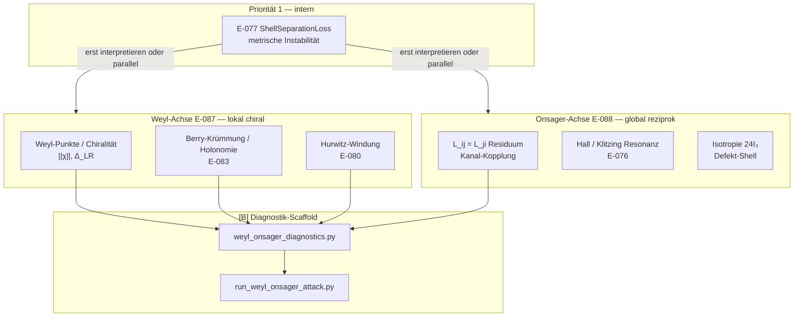

> **Evidence status:** `[C]` Komplettangriff-Dossier (E-087, E-088) · **Geschwister:** [`weyl_commutator_operator_bridge.md`](weyl_commutator_operator_bridge.md) (ORQ-087), [`onsager_quantization_bridge.md`](onsager_quantization_bridge.md) (E-089)  
> **Register:** E-076, E-077, E-080–E-083, E-087, E-088, E-089 · **Stub:** `src/kepler_hurwitz/weyl_onsager_diagnostics.py`

# Weyl–Onsager Komplettangriff

**Stand:** 5. Juli 2026  
**Governance:** `[C]` — Upgrade zu `[B]` nur über reproduzierbare Diagnostik mit Nullmodellen

---

## Kurzantwort

**Komplettangriff** = koordinierter `[C]`-Angriff auf **drei offene Achsen** gleichzeitig — **kein Beweis**, kein Großsatz:

1. **Interne Geometrie** (E-077): metrischer Separationsverlust — **Priorität 1**
2. **Weyl-Achse** (E-087): lokale Chiralität, Berry-Krümmung, Hurwitz-Windung (E-080, E-083)
3. **Onsager-Achse** (E-088): globale Reziprozität, Hall/Klitzing-Resonanz (E-076), Defekt-Shell-Kompensation

Die beiden Physikachsen liefern **Lesesprache + Diagnostik-Stubs** für morgen — sie folgen der internen Shell-Loss-Frage oder laufen als parallele `[B]`-Exports.

\[
\boxed{
\text{Komplettangriff = Lesesprache + Diagnostik, nicht Großsatz.}
}
\]

---

## Governance (verbindlich)

| Kurzformel | Bedeutung |
|---|---|
| **`[A]` etablierte Physik** | Weyl-Punkte, chiral anomaly, Onsager-Relationen, QHE — nur Referenzbild |
| **`[C]` Interpretation** | EABC-Lesefragen entlang Weyl/Onsager-Achsen |
| **`[B]` Diagnostik** | Erst nach reproduzierbarem Export (`weyl_onsager_diagnostics.py`) |
| **E-077 zuerst** | Weyl/Onsager-Deutung **nach** internem Shell-Loss **oder** parallel als reine Diagnostik |
| **Trennung E-087 ↔ E-088 ↔ E-089** | Weyl-Chiralität, Onsager-Reziprozität und vier-Achsen-Dossier E-089 ergänzen sich — keine gegenseitige Deduktion |

**Nicht behaupten:**

- Weyl beweist EABC, Dedekind $\Phi(v)=\gamma$ oder Berry-Holonomie-Identität
- Onsager beweist Collatz, `ShellSeparationLoss` oder Ising-Kritikalität im Formal Core
- Hall-Effekt = Hurwitz-Primzahlen oder mod-$12$-Kanalpartition

---

## Ordnungs-Defekt-Parallelismus (ORQ-089 ↔ ORQ-087)

| Ebene | Status | Bedeutung |
|---|---|---|
| Lehrbuchrelation Weyl-Algebra $[A,B]=AB-BA=I$ | `[A]` | Standardformel |
| Deutung als Ordnungs-Defekt | `[C]` | repo-interne Resonanzsprache |
| Brücke zu EABC/Hurwitz | `[B]`/`[C]` | strukturelle Analogie |
| Physikalischer Quantenclaim | nicht beansprucht | explizit ausgeschlossen |

**Parallelismus:**

- **Onsager:** Umlaufen einer Schleife hinterlässt Zirkulation
- **Weyl:** Vertauschen zweier Operatoren hinterlässt Kommutator
- topologischer Defekt ↔ algebraischer Ordnungs-Defekt
- Bridge ORQ-089 ↔ ORQ-087

---

## Weyl-Block (E-087)

### Kernfragen

| Frage | EABC/Hurwitz-Anker | Status |
|---|---|---|
| Gibt es effektive **Weyl-Punkte** (Band-Touching) auf Orbit-Parameterraum? | CEAB-Rotor, Gap-Rotor, Kanalrand | `[C]` |
| Trägt **chiral anomaly**-Sprache zu $\|\chi\|$ und $\Delta_{\mathrm{LR}}$ bei? | `chirality_norm`, ORQ-087 | `[C]`/`[B]` Stub |
| Lässt sich **Berry-Krümmung** diskret auf geschlossenen Orbiten lesen? | E-083, `berry_holonomy_product` | `[C]`/`[B]` Stub |
| Korrespondiert **Hurwitz-Windung** (E-080) mit effektiver Monopolladung? | `MonopoleHurwitzWindingHypothesis` | `[C]` |

### Formeln (Referenzbild, nicht EABC-Kern)

**Weyl-Gleichung** (Massless chiral mode — **Metapher** für Kanalrand-Moden):

$$\sigma^\mu \partial_\mu \psi = 0, \qquad \chi = \pm 1 \text{ (Chiralität)}$$

**Berry-Holonomie** (diskrete Lesart):

$$\gamma_B = \exp\!\left(i \sum_k \phi_k\right), \qquad \Phi_B = \arg(\gamma_B)$$

**Chiralitätsnorm** (Atlas-Diagnostik, wiederverwendet):

$$\|\chi\| = \sqrt{\alpha^2 + \beta^2 + \gamma^2}$$

mit $\alpha = E_+ - E_-$, $\beta = A_+ - A_-$, $\gamma = B_+ - B_-$ aus der 8D-Hurwitz-Signatur.

### Mapping Weyl → EABC/Hurwitz

| Weyl / Chiral | EABC / Hurwitz | Mechanismus |
|---|---|---|
| Weyl-Punkt (Band-Touching) | CEAB-Kanalrand / Gap-Rotor-Kreuzung | Orbit-Parameter `[C]` |
| Chiral anomaly | $\|\chi\| > 0$, $\Delta_{\mathrm{LR}}(\gamma) > 0$ | Nichtkommutative Defekt-Signatur |
| Berry-Krümmung | Diskrete Phasenprodukte auf Dumas-Orbiten | E-083 Holonomie-Hypothese |
| Hurwitz-Windung | $\mathrm{wind}_{\mathbb H}(O_v)$ | E-080 Monopol-Korrespondenz |
| ABCE/CEAB-Rotor | Gerichtete Kanalumläufe | Phasenanker wie E-076 AB-Achse |

**Governance:** Die Weyl-Gleichung erklärt **warum** Kanalrand-Moden chiral gelesen werden dürfen — sie identifiziert EABC nicht mit einem Weyl-Semimetall.

---

## Onsager-Block (E-088)

### Kernfragen

| Frage | EABC/Hurwitz-Anker | Status |
|---|---|---|
| Erfüllt eine **4×4-EABC-Kopplungsmatrix** Onsager-Reziprozität $L_{ij}=L_{ji}$? | Kanal-Kopplungstoy, `onsager_reciprocity_residual` | `[B]` Stub |
| Resoniert **Hall/Klitzing** (E-076) mit diskreter Kanalbalance? | mod-$12$-Partition, QHE-Plateau-Sprache | `[C]` |
| Trägt **Isotropie-Restauration** $24I_3$ Defekt-Shell-Kompensation? | Renorm-Kern E-053, Meissner-Lesesprache | `[C]` |
| Parallel zu Dirac–Schwinger (E-081): diskrete **Kopplungsquanten**? | Onsager-Flussquant $\Phi_0$ als Analog | `[C]` |

### Formeln (Referenzbild)

**Onsager-Reziprozität** (im Gleichgewicht, Mikroreversibilität):

$$L_{ij} = L_{ji}$$

**Residuum** (Diagnostik-Toy):

$$R_{\mathrm{rec}} = \sum_{i<j} \bigl(L_{ij} - L_{ji}\bigr)^2$$

**von Klitzing / QHE** (Geschwister zu E-076, nicht Identität):

$$R_H = \frac{h}{n e^2}, \qquad n \in \mathbb{Z}$$

**Isotropie-Restauration** (Renorm-Kern):

$$\Delta \to R^* \to 24I_3$$

### Mapping Onsager → EABC/Hurwitz

| Onsager-Bild | EABC / Hurwitz | Mechanismus |
|---|---|---|
| Reziprozitätsrelationen | Symmetrie der Kanal-Kopplung | Zeitumkehr-Lesesprache `[C]` |
| Flussquantisierung $\Phi_0$ | Diskrete Phasenabschlüsse auf Orbiten | E-089 Achse 1; E-088 fokussiert Reziprozität |
| Quantisierte Wirbel | Gap-Rotor-Umlauf, CEAB-Holonomie | `onsager_vortex_diagnostics.py` |
| 2D-Ising-Kritikalität | **Nicht** ShellSeparationLoss | Governance-Grenze |
| Hall-Plateaus | mod-$12$-Kanalgrenzen | E-076 Klitzing-Achse |

**Governance:** Onsager-Reziprozität misst **globale Kopplungssymmetrie** — komplementär zu Weyl-**lokaler** Chiralität ($\Delta_{\mathrm{LR}}$), nicht Ersatz.

---

## Kombiniertes Angriffsdiagramm

---

## Priorität und Reihenfolge

\[
\boxed{
\text{E-077 bleibt Priorität 1. Weyl/Onsager sind interpretativ oder parallele } [B]\text{-Diagnostik.}
}
\]

| Schritt | Aktion | Status |
|---|---|---|
| 1 | `ShellSeparationLoss(n)` blind/intern testen | E-077 `[C]`/`[B]` |
| 2 | Weyl/Onsager-Stubs auf Primquadruplet-Atlas laufen lassen | `[B]` Kandidat |
| 3 | Nullmodelle (CEAB-Shuffle) für Chiralität und Reziprozität | `[B]` |
| 4 | Erst **nach** reproduzierbarem E-077-Befund: physikalische Deutung | `[C]` only |

---

## Minimal-[B]-Operationalisierung

Checkliste für morgen (kein Beweis, nur reproduzierbare Metriken):

- [ ] `weyl_chirality_proxy(α, β, γ)` auf Atlas-Primquadruplets exportieren
- [ ] `onsager_reciprocity_residual(L)` für 4×4-Kanal-Kopplungstoy aus Hurwitz-Signatur
- [ ] `berry_holonomy_product(edge_phases)` auf Gap-Rotor-/CEAB-Schleifen
- [ ] Korrelation mit `delta_lr_norm` (ORQ-087) und Onsager-Wirbel-Export (E-089)
- [ ] CEAB-Nullmodell: unterscheidet sich $R_{\mathrm{rec}}$ signifikant?
- [ ] JSON-Export via `examples/run_weyl_onsager_attack.py`
- [ ] **Kein** Upgrade zu `[A]` ohne Lean- oder Beweispfad

---

## Governance-Schlussboxen

\[
\boxed{
\text{Was ist formal definierbar? Was ist nur Physik-Analogie? Was ist empirisch testbar? Was hängt wovon ab?}
}
\]

\[
\boxed{
\begin{aligned}
&\text{Open-Core-Pfad: interne Geometrie vor externer Deutung.} \\
&\text{Weyl = lokale Chiralität; Onsager = globale Reziprozität.} \\
&\text{Komplettangriff koordiniert beide — beweist keines.}
\end{aligned}
}
\]

---

## See also / Siehe auch

**EN:** See also ORQ-089: the Onsager vortex model treats circulation as a loop-order defect. ORQ-087 treats non-commutability as an operator-order defect. Both are used as structural analogies, not as physical claims for the EABC/Hurwitz program.

**DE:** Siehe auch ORQ-089: Das Onsager-Wirbelmodell liest Zirkulation als Schleifen-Ordnungs-Defekt. ORQ-087 liest Nichtkommutativität als Operator-Ordnungs-Defekt. Beide dienen als strukturelle Analogien — nicht als physikalische Claims für das EABC/Hurwitz-Programm.

---

## Querverweise

| Dokument | Rolle |
|---|---|
| [`weyl_commutator_operator_bridge.md`](weyl_commutator_operator_bridge.md) | ORQ-087, $\Delta_{\mathrm{LR}}$ |
| [`onsager_quantization_bridge.md`](onsager_quantization_bridge.md) | E-089, vier Onsager-Achsen |
| [`../open_mathematical_bridge_targets.md`](../open_mathematical_bridge_targets.md) | Governance-Katalog |
| [`../reports/physical_reference_analogies.md`](../reports/physical_reference_analogies.md) | E-076 AB/Klitzing/Meissner |
| [`meissner_analogy_assessment.md`](meissner_analogy_assessment.md) | Meissner als Lesesprache, kein Hauptangriff |
| `src/kepler_hurwitz/weyl_onsager_diagnostics.py` | Diagnostik-Stub |
| `examples/run_weyl_onsager_attack.py` | JSON-Export |
